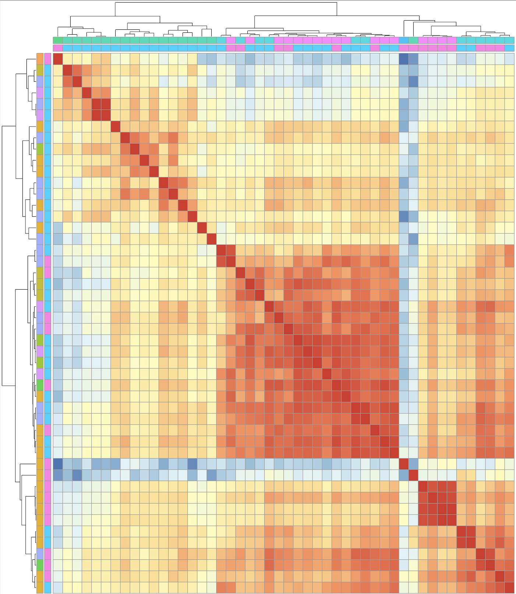

## Project 1: De-Identification Pipeline [wiki](https://github.com/FredHutch/nlp-airflow-dags/wiki)

- Pull notes from the server and identify personal health information (PHI) using Name Entity Recognition algorithms.
- Check notes and determine the notes for manual review.
- Developed resynthesis algorithm used for replacing identifiers (name, address, etc) with surrogates back into the raw text.  

<!--  -->

## Project 2: Cluster Membership

Scope: clustered 48 antigens into 4 groups. 

- Fitted standardized data across time point and treatment groups. 
- Applied hierarchical clustering algorithm with Ward’s minimum variance method to find compact, spherical clusters.
- Chose the best number of clusters by cutting the corresponding hierachical tree based on their Pearson's correlation.

## Project 3: Lending Club Loan Risk Prediction 

Data size: 500k+; Data Source: [Link](https://www.lendingclub.com/statistics/additional-statistics?)

- Cleaned and processed the lending club open souce dataset (2019 Q1-Q4).
- Applied feature engineering to 150+ features, and revealed the top factors for loan risks.
- Trained Random Forest and Gradient Boosting to predict loan risks (average precision & recall > 75%)
- Created an interactive loan risk prediction using Flask API (below). 

<!--  -->

## Project 4: Data Visualization of COVID 

Dashboard: [link](https://ddong63.github.io/COVID-19/)

- Processed the COVID structured data (incl. data quality check) using dplyr
- Created plots with ggplot2 and plotly to show the trends over time

<!--  -->

